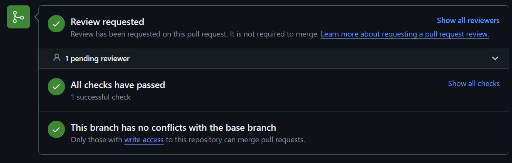

## What is Godot?
Godot is a free and open source game engine available for free download from [the Godot website](https://godotengine.org/).

## Why this project?
I recently did a Comm Arch about godot and how easy it is to make edits, so I thought it would be something nice to contribute to

## Comm Arch Experience
My Comm Arch experience told me that this would be a good project to contribute to. Godot is heavily documented as is its contribution process & onboarding
The Area Owners/teams can assist as well with questions about certain sections. They even had instructions for making changes to anything such as page editing documentation(which is shown below)

## The Issue
I choose my Issue by starting very small. I viewed the 'good-first-issue' tag.I had no experince with godot code or coding within godot and 
so when looking through the issues I found a bug that was centered around a  built-in CAMERA_VISIBLE_LAYERS Shader being undocumented according to the issue, this Shader was added back in 2022 but nobody had documented yet. I felt like that was something I could fix and so I went right to it

## Was I successful?
The fix was simple especially with the guidence they give to people who want to fix or add any documentation and so I went into the appropriate file within the repository and added the necessary change

all I had to do affter that was make a pull request
I then got a message telling me I was trying to commit into the wrong repository but they told me to commit to main and all would be good.And so I did

## Was I successful now?
I have no clue. Since I've made the fix It still hasn't been added the the main branch. So maybe there is a reason why the documentation hasn't been added this entire time. But 
I should've expected this given that during my comm Arch, I learned that Godot has a lot of issues that have been opened and still haven't been fixed yet, So I can only assume my fix won't be added anytime soon

