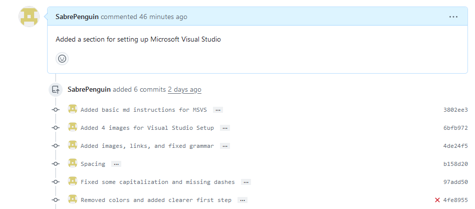
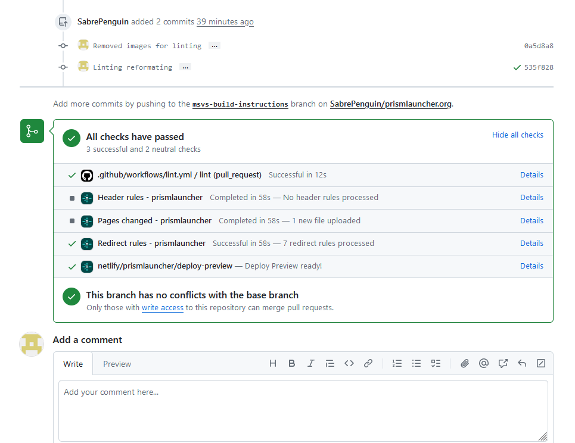

For my contribution, I initially planned to add extra information to the SDL2 wiki. However, a more grevious error on the project I planned to do a bug fix on caught my attention.
That is, it had instructions for using VSCode to build a C++ project, but not for Visual Studio. For me, this was terrible for a few reasons.

1. VSCode is note built for c/c++. A ton of extra things have to be installed to get it to even somewhat work.
2. Visual Studio already has to be installed for anyone building the project on Windows
3. Visual Studio is basically purpose-built for building C, C++, and other similar compiled languages

## What is Prism Launcher

Prism Launcher is a fairly popular third party Minecraft launcher. Due to Minecraft having a limited amount of official modding support, third party tools to manage
several versions of mods have been created. Prism describes itself as

["An Open Source Minecraft launcher with the ability to manage multiple instances, accounts and mods. Focused on user freedom and free redistributability."](https://prismlauncher.org/)

Prism is forked from PolyMC, a similar launcher, which is itself forked from MultiMC. Prism forked when PolyMC posted a malicious commit onto GitHub.

## Getting involved

Prism Launcher requires reading both the Code of Conduct and the Contributing guidelines before contributing. They then have several different locations to join, with Discord and Matrix being
the main locations for developers to communicate.

Upon joining Discord, it asked which roles I wanted, so I selected developement. This opened up all the different contribution channels to communicate in, such as translating, testing, developing, design, and web-dev.

## Contributing 

My contribution was, as stated before, adding a set of build instructions for Visual Studio. This is significantly different from my planned bug fix, as the bug fix is entirely in C++ while this was
purely markdown. The only "tricky" part was finding the website repository, as it wasn't in the main Prism repository.

### Completing the Contribution

The contribution was fairly simple. The website is run off of node.js, and I already had it installed on my laptop from another project. The main difficulty came from trying to find the
exact steps for setting up Visual Studio.

**Blockers**

- The main difficulty came from trying to get Visual Studio to find QT's dlls. This was solved by eventually searching for and finding a reddit post.
- The web-dev channel isn't talked in very much, so I didn't know how long it would take to get any responses. Fortunately, it was fast.
- Linting markdown

**Pull Request**

As of March 31st, I have initiated a pull request with proper formatting. My initial pull request didn't pass the linting check, so I had to add a couple lines and reorganize the lists and images.
It now only waits for approval from a contributor with access.

