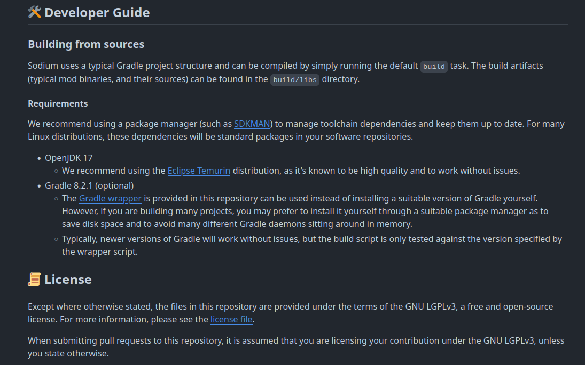
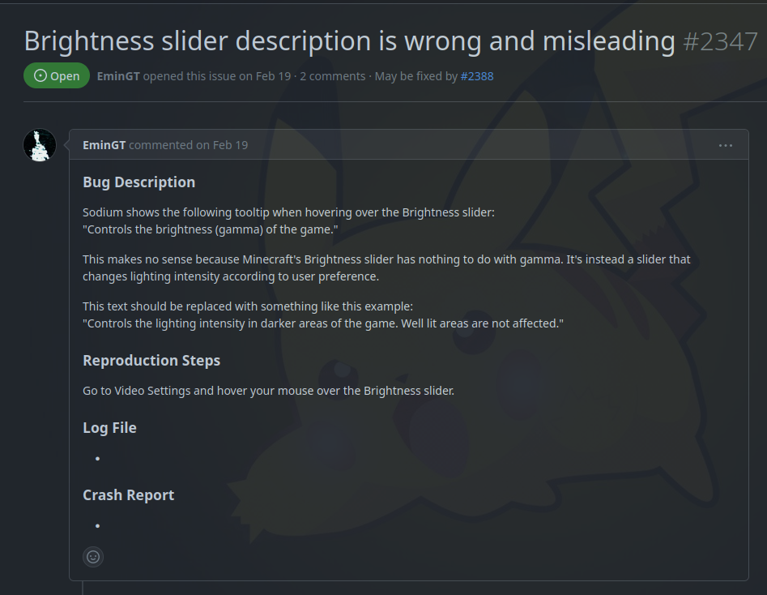
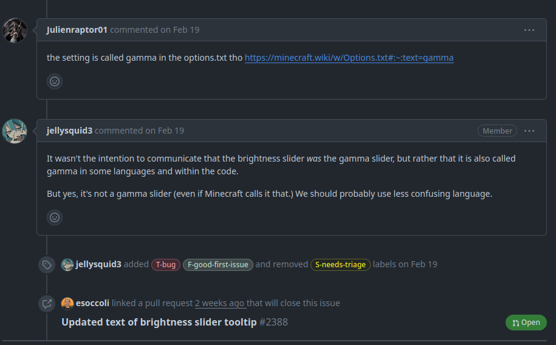
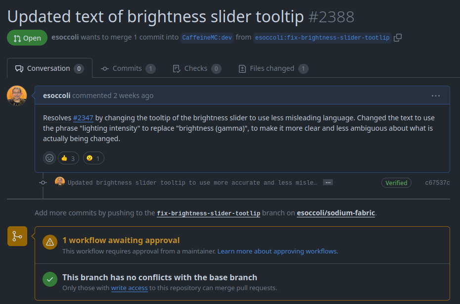

## Sodium Fabric - What is it?

Sodium Fabric is an optimization mod for Minecraft that provides a variety of optimizations and enhancements to improve game performance and framerate. The mod is designed to be used with the Fabric mod loader, which is a mod loader similar to Forge, but with a focus on supporting the newer Minecraft versions.

## Why this project?

When I started looking for a project to contribute to, the first thing I started searching for was Minecraft related projects. it did not take long before I saw the repo for this mod. Sodium Fabric is a must-have mod for me whenever I am playing Minecraft. In addition to better game performance, this mod also makes more game options modifiable by the player, which is something that I like to have. Combining my positive experiences using this mod with the well organized and managed repo, it made it quite easy to make my decision about what I wanted to contribute to.

## Selecting an Issue

Once I had decided what project I wanted to contribute to, I started looking through the open issues to see if I could find one that looked doable. A lot of the more recent issues had to do with issues between Sodium and some other mod, and since I don't really play modded, I decided to avoid those types of issues. After a little bit of searching (and help from the filter by label functionality), I found an issue titled `Brightness slider description is wrong and misleading`. This issue was also labelled as a good first issue, so I decided to take a look at it. From looking at the provided information, this issue seemed like it would be fairly straight forward, so I decided to go for it.

## Fixing the Issue

After deciding what issue I wanted to fix, the first step I took was looking through the codebase to try to figure out what exactly I needed to change. After looking through a few files, and I found one that called the `setTooltip` method. I went to look at the definition of that method, but found that it was not what I was looking for. While that method actually assigned the tooltip text to the actual tooltip, the text being used for the tooltips were being stored elsewhere. After that, I decided to just look through all the files in the project, since there are not a ton of files. After looking through every other file in the repo, I went to check a file titled `en_us.json` that was located within the `lang` directory, and that contained exactly what I was looking for. Once I had found that, the actual fix was as simple as updating the string being stored as the tooltip text for the brightness slider. As for what I changed it to, there had been a suggestion of what to change it to provided by the person that opened this issue, which changed the phrasing of it to use the term `lighting intensity` rather than `gamma`. With that change made, that seemed to resolve the issue in question, so I pushed my changes and opened a pull request. As of today (4/6/24), my PR has been open for 2 weeks, and has gotten a total of 3 thumbs up reactions, and no reviews or comments.

## Conclusion

Overall, I had a good experience working on this issue and project. While the specific issue I chose to work on was pretty simple to fix, I still feel that this was great experience for me, because it allowed me to get the experience of contributing to a project that I have never seen the codebase of before. Prior to this, all of my contributions to open source projects were to projects that I was familiar with in some capacity, but this gave me the experience of going through the onboarding process for a project, which I believe is a very good thing to have experience with.