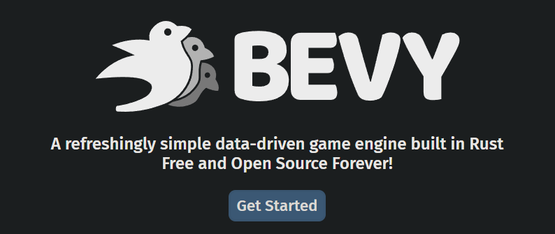
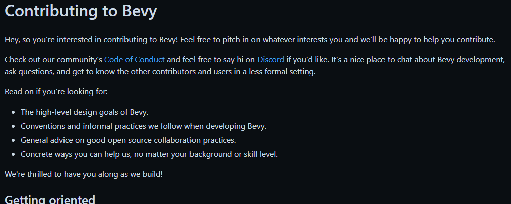
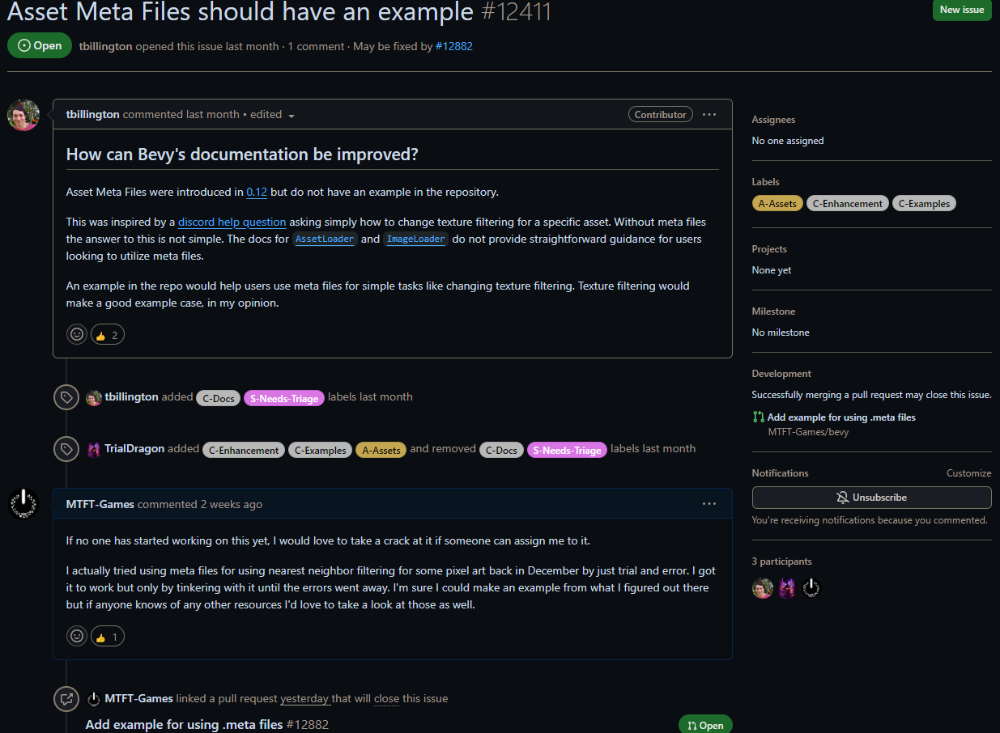
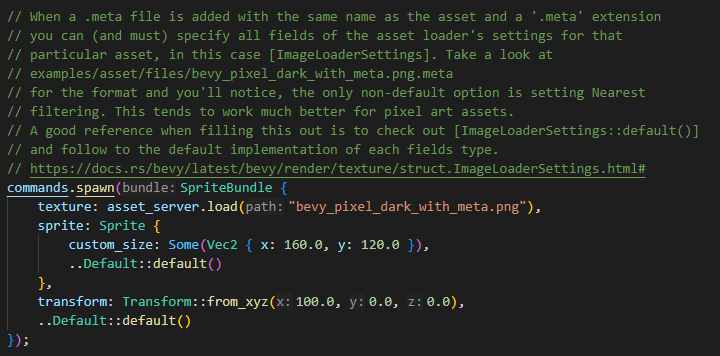
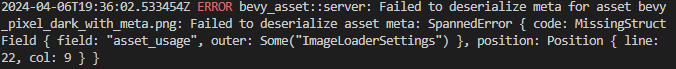
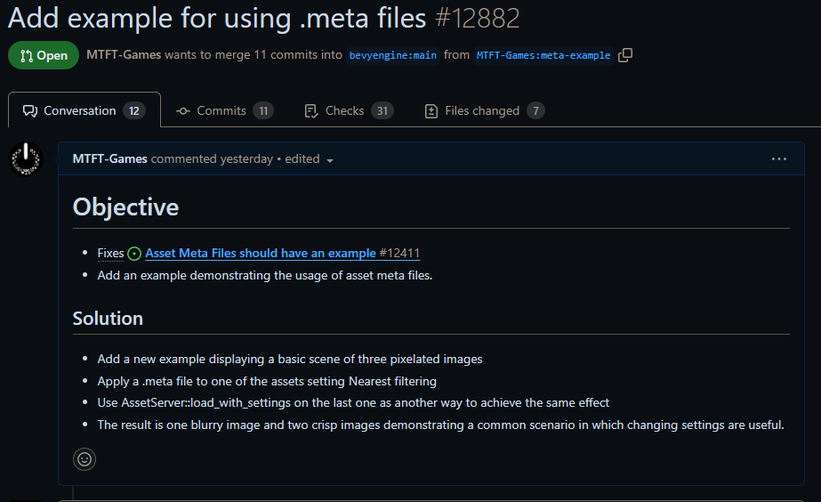
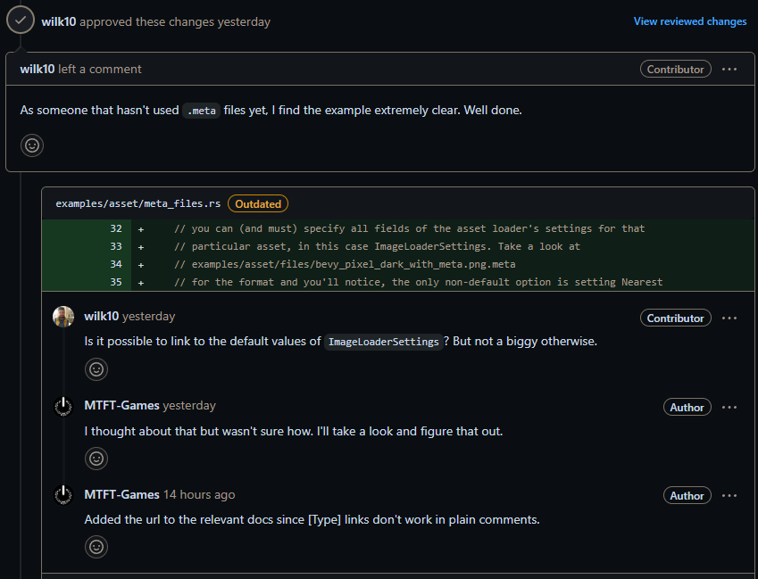
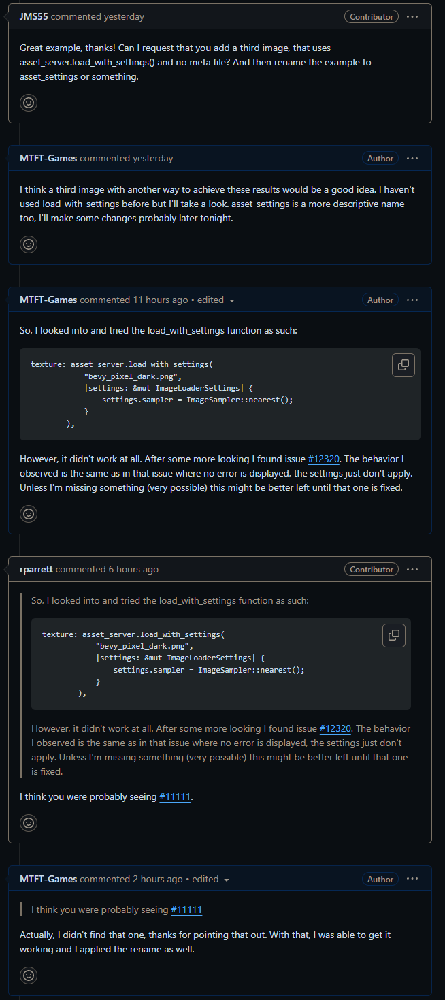

# Bevy

[Bevy](https://bevyengine.org/) is a free and open source game engine written in [Rust](https://www.rust-lang.org/). I picked it as a community to contribute to because I have used it in the past, I wanted to work more in Rust, and I have previously thought about an area of lacking documentation that I have some knowledge in. 

My Comm Arch experience did not cover this project but several factors indicated that this would be good to work with. The project is in active development with new versions releasing regularly, the process for contributing is fairly straightforward, and the community is quite active across their communication channels.

Resources that I looked at for this contribution included the [contributing guide](https://github.com/bevyengine/bevy/blob/main/CONTRIBUTING.md), other [examples](https://github.com/bevyengine/bevy/tree/main/examples#readme), and the [docs/source](https://docs.rs/bevy/latest/bevy/).

# Missing example for asset settings

I decided ahead of time that I wanted to add a new example to the project demonstrating how to use .meta files when loading assets because I figured out how to do this in the past and it was quite the pain without docs or examples. Since I never posted an issue myself when I struggled to figure out this feature without an example, I first searched through the existing issues to find that someone else has created an [issue](https://github.com/bevyengine/bevy/issues/12411) about this. The first thing I then did after reading through the contributing guide was comment on the issue to express my interest in resolving it and make sure no one else was already working on it.

Next I [forked](https://github.com/MTFT-Games/bevy/tree/meta-example) the repo and started creating a new example, following the format of other examples to build the most minimal project to demonstrate the feature. I copied some work from [my own projects in bevy](https://github.com/MTFT-Games/void-break-reborn) where I figured this feature out and added lots of explanation comments for others to follow. 

The first problem I ran into after setting up the basics was that the newest release of Bevy added some extra steps that I needed to figure out since the last time I figured this feature out. 

After some fiddling and consulting docs/source, I got it working and made a [PR](https://github.com/bevyengine/bevy/pull/12882). 

The next day I had some feedback and suggestions along with ci checks. The rest was implementing these suggestions and improvements.

At this point I have finished implementing the changes and improvements from reviews and feedback so far. The next steps are just to wait for more feedback and reviews and if all looks good it should get merged after some time.
