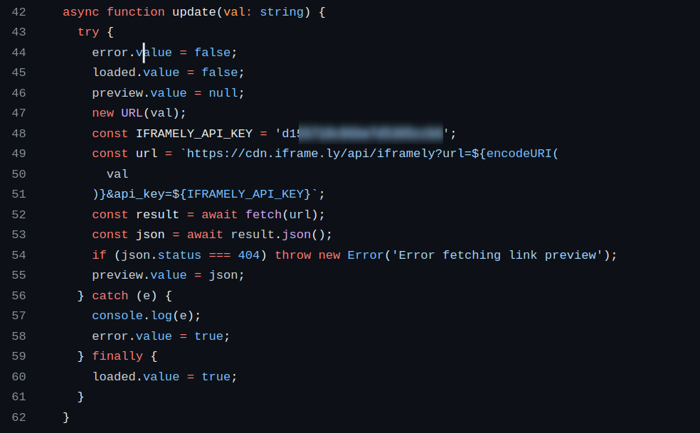
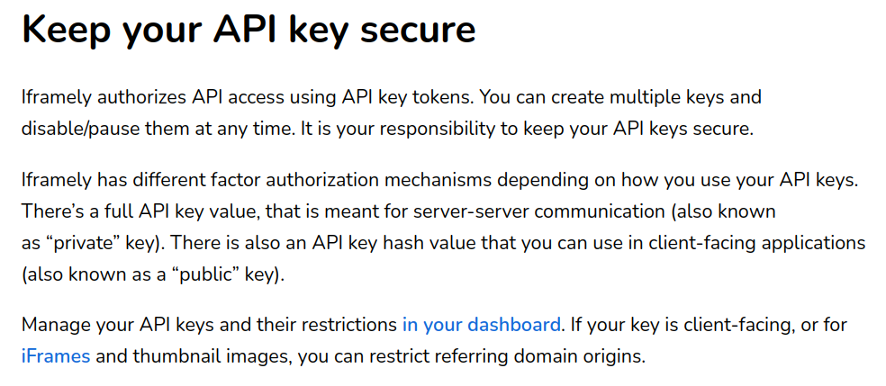

# What is Snapshot

[Project Website](https://snapshot.org/#/)

[GitHub Page](https://github.com/snapshot-labs/snapshot)

Snapshot is a voting platform for decentralized means of finance. Primarily, this is a (self-hostable) community platform for NFT communities to vote in a simple manner, with emphasis on the lack of gas fees for votes. 

This software allows for a lot of customization for organizations, such as differently calculated user voting powers, proposals, vote validation, and more. 

I selected this project out of my interest of decentralized platforms and my interest of the cryptocurrency market. I'm also heavily interested in web application security, which my bug fix addresses in this project. 

# Relevance from Comm Arch Experiences
From my previous HFOSS (IGME-582) experiences in Comm Arch assignments, we were tasked with investigating existing open source projects of different sizes. We collected a lot of information, including onboarding processes, contribution guidelines, and recommending projects for a specific skill leve. These skills were relevant in my selection of this project, as I was able to find a bug tailored to my skills and provide a security-related bug fix in the project. 

# Resources Available
[Documentation Website](https://docs.snapshot.org/)

Documentation was provided through the above documentation website, providing developer and project information. Further, the public Discord server was available for any questions. 

# The Issue
The issue that I investigated in this project was in regards to api key management. For particularly, upon reviewing the functionality of this project, I came to realize that an API key was hardcoded into one of the vue files, as such

IFramely is a delivery service for rich media embeds and URL data, and offer different levels of pricing that serve limited amounts of usage. 

This service also mentions the following in their own documentation: 

Thus, developers (and users interested in self-hosting this project) are encouraged to generate their own API keys for this service instead. The best practice for managing this with the vue programming language is to set up a separate configuration file to host this information, then import it into the code. 

So, I forked the repository and opened a branch and made the appropriate changes, which lead to me making a pull request. Before pushing anything, I made sure the code ran without issues on my own machine and when containerized with the Dockerfile, and everything built and ran without new errors. 

As of the writing of this blog post, the PR opened has not been accepted/declined, 

[Link to pull request](https://github.com/snapshot-labs/snapshot/pull/4661)