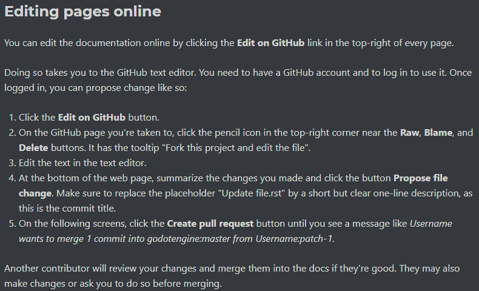
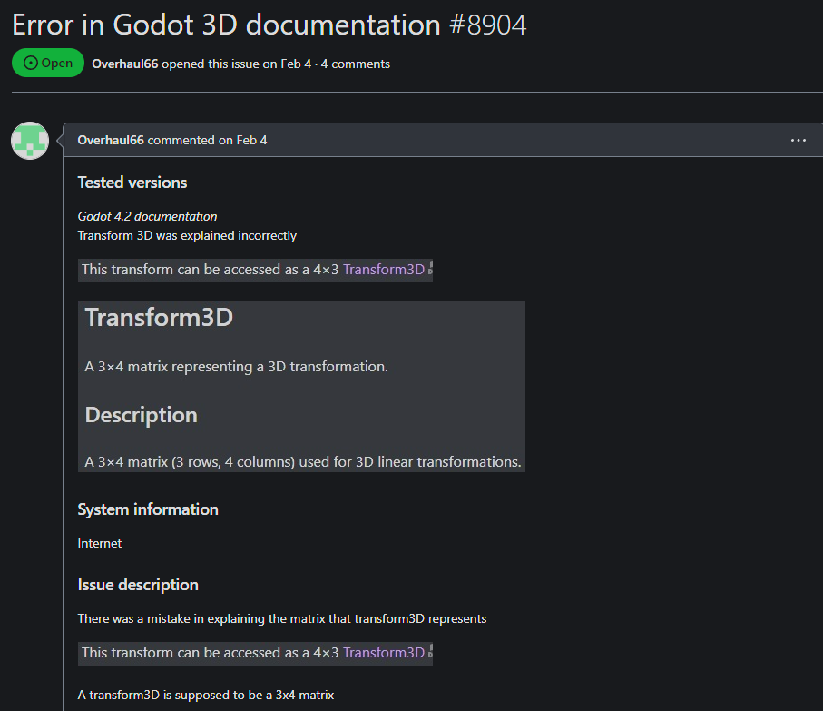
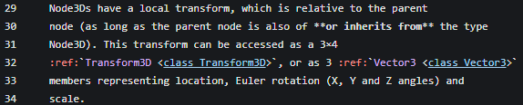
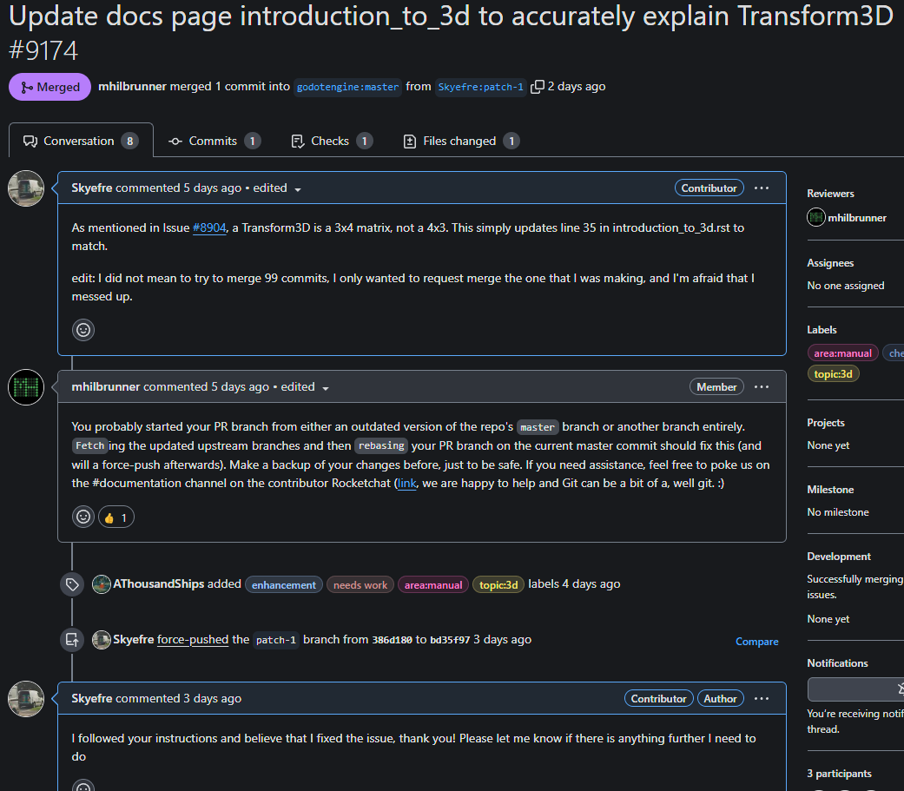
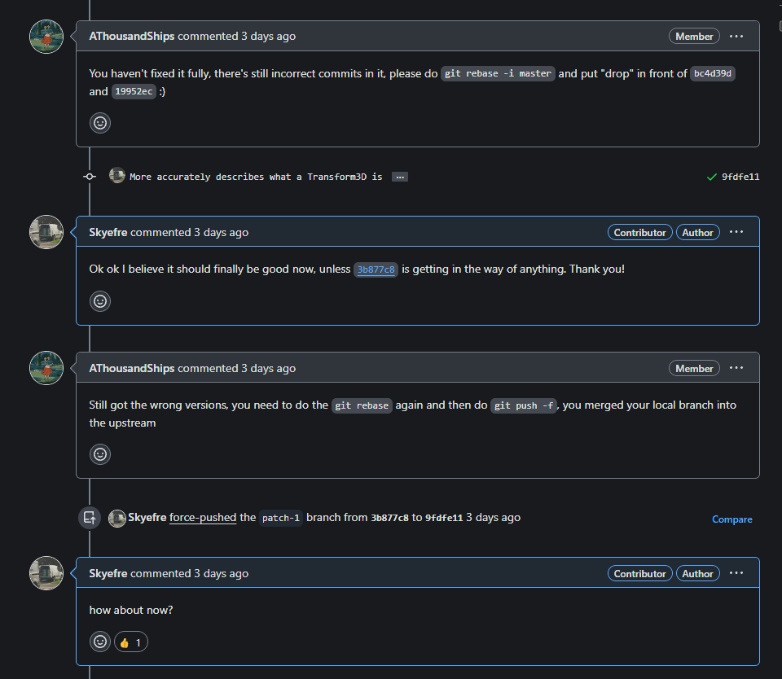
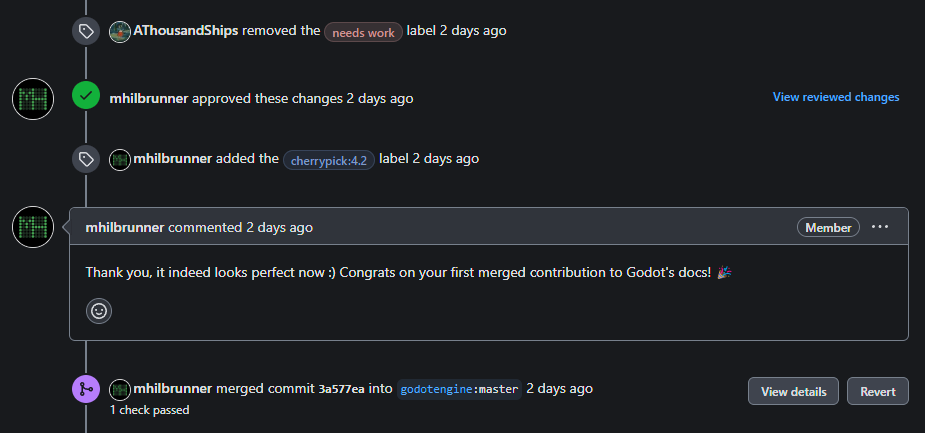

## Godot
Godot is a free and open source game engine available for free download from [Godot](https://godotengine.org/). I picked it for my project because I have been working in Godot for the past 2 semesters, and I find the engine to be fun.

## Comm Arch Experience
My Comm Arch experience told me that this would be a good project to contribute to. Firstly, another group did a presentation on this project and gave it a recommendation. They also have a large amount of resources available in their [GitHub](https://github.com/godotengine), [Website](https://godotengine.org/), and [Docs Website](https://docs.godotengine.org/en/stable/) with sufficient onboarding to contribute. The most helpful information was on their docs site, captured in the image below.

## Picking My Issue
In my time working in Godot, I have noticed that their documentation doesn't always match up to the actual process that one has to go through in-engine to achieve something. While looking through their godot-docs github page, I noticed that several issues were marked as good first issues, so i looked through them and picked this one:

This person pointed out that 3D transform matrices were being explained incorrectly, so I thought to myself that this would be an easy first issue to get myself acquainted with the contribution process.

## Process
I started out with forking the repo directly in github, as was recommended in the guidelines. I then simply directly made my edit to the line that needed changing (line 31 in the following image) before saving and continuing on.

I then saved my changes, attached an appropriate commit message, and set my branch-to-be-merged to the master branch, as stated in the guidelines. I then made the pull request, and immediately panicked after seeing that I was committing 99 other commits as well.

## Fetching and Rebasing
Despite the panic that I felt from having 99 other commits when it was supposed to be just my commit, the person who was helping me was very polite and helpful as can be seen in the above image. They informed me I likely just started my pull request from an outdated master branch, and had to fetch and rebase my branch. Naturally, that is what I did.
I opened GitHub Desktop, went to the Branch tab, and proceeded to fetch from upstream, and then rebase my branch. Finally done right? Nope!

I still had commits that weren't mine in the branch, and now had to breakout GitBash to remove them. I opened GitBash, rebased my branch again, this time dropping the commits that were still lingering around, and pushed again. While doing that, I accidentally merged my local branch into upstream, and had to repeat that process one more time. Now, I was finally done.

I did it! my first contribution to an open source project! It felt good when it was over, and I'm glad I had as many issues as I did as it taught me how to deal with them in the future, and I'm sure that knowledge will be useful when I am working on my contribution.
