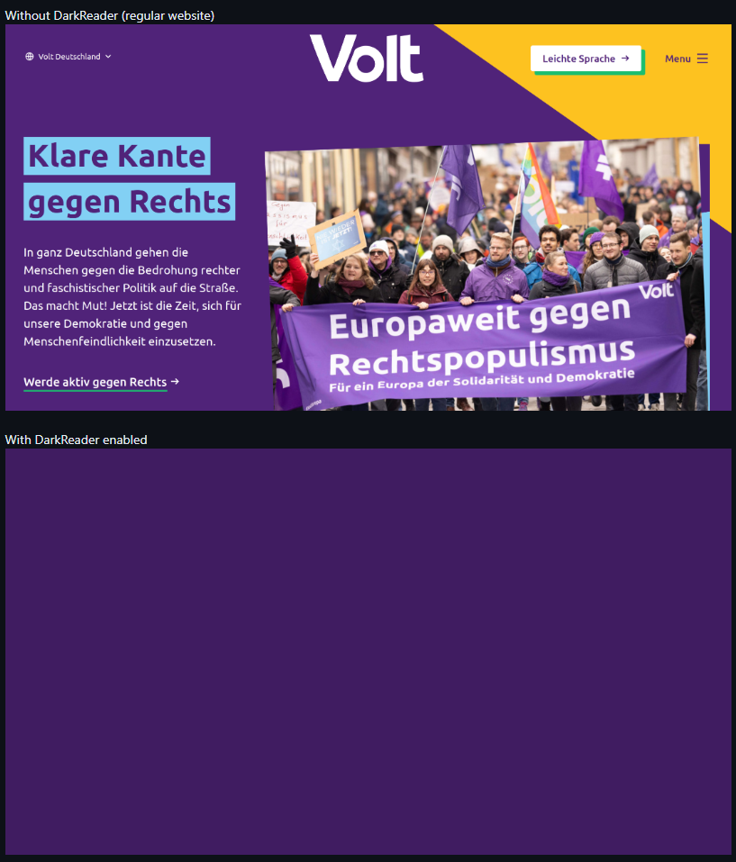
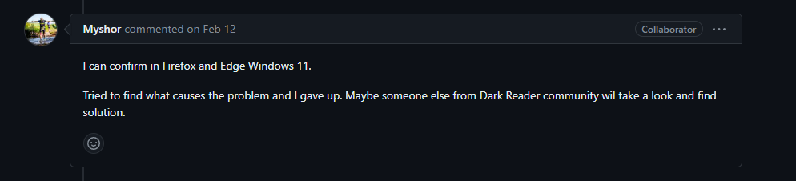

## What is Dark Reader?

Dark Reader is a browser extension for Chrome and Firefox-based browsers. Its main purpose is to apply a dark theme to websites that don’t have one natively. It does this by modifying the colors of the website using their “Dynamic Mode” and applying community-written site fixes to websites where Dark Reader didn’t get it quite right. 

## Why Dark Reader?
I chose Dark Reader for my bug fix contribution for a few reasons. First, it’s an extension I use every day on my devices, and I appreciate its value. I also chose it because I’ve had experience contributing before, and I’m a fan of the friendly community and quick PR reviews.

## What issue to fix!?
After deciding I wanted to contribute to Dark Reader for my bug fix, I had to figure out what issue I wanted to look into. I was looking through the recent issues when I stumbled upon #12292, a broken site. The crux of the issue was that the background color of the site, purple, was showing up as a full-screen overlay on top of the content, so you couldn’t see any content. Reading through this issue, I saw screenshots of the behavior, which looked like this:

I also saw Myshor, who’s one of the main contributors, comment on the issue, which didn’t seem promising:

## Doin' the fix.

After a little bit of looking at the initial screenshots, I realized that I had recently done a fix for a very similar site called voltnederlands.org (the Dutch counterpart). Looking back at my code and applying it to the new site, I found that it fixed the major issue of the full-screen purple. It wasn’t a perfect fix, but I decided to open a PR since it made the site usable:

Shortly after creating the PR, Myshor messaged in the issue, saying that they had found a few things that were still broken with my fix and that they would look into fixing them. Before I could look any further into solving the other issue, they had already pushed to my PR with the addition. They then merged my PR to main, and the site fix was live!

## Conclusion

Overall, I had fun contributing to this project with a site fix and found it to be very rewarding, especially since I was able to collaborate with Myshor. The issue was relatively easy to fix overall, but I still think it was valuable to get the experience of contributing with a pull request. If you'd like to take a look at [the original issue](https://github.com/darkreader/darkreader/issues/12292) and [my pull request](https://github.com/darkreader/darkreader/pull/12312) , feel free to check out the links. Thanks for reading!