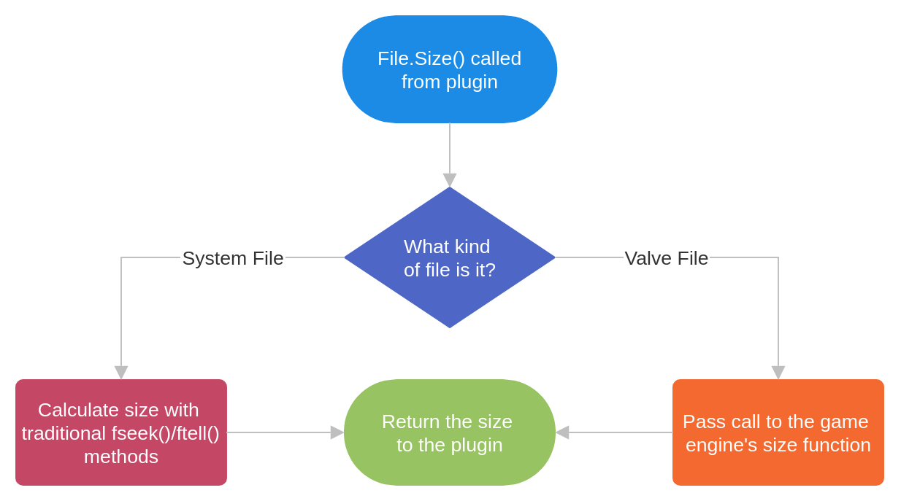

# What is Sourcemod

[Project Website](https://www.sourcemod.net/)

[GitHub Page](https://github.com/alliedmodders/sourcemod)

Sourcemod is a modding platform for source engine games like Left 4 Dead 2, Team Fortress 2, CS:GO (before the transition to CS2), and many others. Sourcemod's primary purpose is to provide a simple interface for it's plugins to interact with the games in a simple and cross platform way.

I personally have a long history with Sourcemod, as I used to run several CS:GO game servers, with my main focus being zombie escape. Sourcemod is very easy to use and has an amazing community that can help you with pretty much anything, because source engine modders have already done pretty much everything. This experience is why I decided to contribute to the project.

Based on my Comm Arch assignment experience I knew this was a good project to work on. The community is very active and it is easy to reach the lead maintainers. Most of the downsides are just relics of being started a very long time ago like their bespoke AMBuild build system and a lack of documentation in some areas, but in general the project is very polished and well maintained.

# The Issue
The issue I chose was a [missing method to get the size of a file object](https://github.com/alliedmodders/sourcemod/issues/1578). There was already a way to get the size of a file directly using the path, utilizing the `stat()` function internally, but file objects only store a file pointer, not the path of that file, which `stat()` takes as an argument. In addition, as sourcemod has continued to develop over the years the general trend is towards the "methodmap" syntax, e.g. `file.Size()` as opposed to `FileSize(file)`. The more standard convention and improved functionality that would be offered by implementing this feature drew me to it.

Before working on fixing the issue I had to familiarize myself with the file handling code. The code that handles the file function calls from plugins is in `core/logic/smn_filesystem.cpp`. From there I was able to look at the other file function calls, and determine how to add this methodmap function. 

Internally there are two file types wrapped in a `FileObject`. The first and simplest is the `SystemFile`. This type of file is handled entirely by Sourcemod, and just uses the standard `fopen`/`fread`/etc functions to interact with files. I had to implement a size function for this type of file which I was able to do by seeking the file pointer to the end of the file and recording that position as the size. I also did not want to interfere with the position the file pointer was already pointing at, so I made sure to cache the position at the time the function was called and then restore that position after the size was found.

The other type of file is the `ValveFile`. Those files are handled by wrapping internal source engine functionality with a logic bridge. Luckily the source engine already has a size method that takes their `FileHandle_t` type, but this needed to implemented as a part of the logic bridge. First the bridge header file `bridge/include/IFileSystemBridge.h` had to be edited to declare a `Size` function that takes a `FileHandle_t` file. Then the implementation of that `Size` method had to be done in `core/logic_bridge.cpp`, where it was added to the `VFileSystem_Logic` class. This allowed the code in `core/logic/smn_filesystem.cpp` to call that method, so the `Size` function was implemented for `ValveFile` by just calling the `Size` function on the `FileHandle_t`.

It may be hard to follow the logic flow I described in the past two paragraphs, so I created a block diagram to help visualize the path of the function.

Next the actual logic to handle calls from plugins had to be written. By inspecting other functions I was able to read in the sole parameter of the file handle for the `Size` method. Then that handle was converted to the internal `FileObject` which would call either the `SystemFile` or the `ValveFile` implementation depending on which one it is at runtime.

Finally the method had to be exposed to plugins. Sourcemod plugins use include files (.inc) to get definitions for available functions/methods. The include file related to file handling is `plugins/include/files.inc`. Here I simply had to add a declaration for the `Size` method inside the `File` methodmap, as well as a short comment with a description of the behavior which is used to autogenerate documentation.

# Results
I tested my changes by writing a quick example plugin that compared the old method of getting a File's size with my new method and printed the results. My method reported the same as the old method, so it should be all good.

I have submitted my changes to the project as a [pull request](https://github.com/alliedmodders/sourcemod/pull/2131). It has not yet been accepted or received any comments, however it did pass CI, and one user did react with a thumbs up. I think if there is any debate it will be about the use of `seek()`/`tell()` to get the size of system files, but I recently learned about the `fstat()` function which works on file descriptors so I may investigate that as an alternative.
