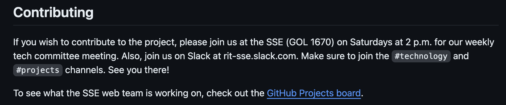
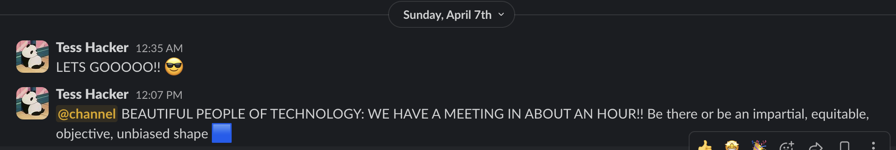

## SSE Website - What and Why
For my contribution, I decided to look at the SSE new's website to look for ways to contribute. I decided to do this because I think that the revamp of the SSE website is important for newcoming and current students to RIT that are software engineering, computer science, or other related majors. The Comm Arch experience that I got showed me that this would be a good project to work with seeing that there is a very clear documentation and also contributing guidelines, which is crucial for contributing, and also the issues page on their GitHub is very clearly maintained and looked through often. This is also a very recent project, which means that their are many different contributions and people active in creating and solving issues for the project.

## Resources
From the documentation provided in their GitHub, there are two main sections of their project, one relating to their Next.js application and one relating to their documentation with wireframes, domain models and etc. for their project. I had to look through their enviornment set up as well to figure out how to run the application and see what the website currently looks like to look for potential fixes.

## The Issue
While reading through their read me files to look at how to run their application, I noticed that their onboarding process has some incorrect/varying dates for their scheduled meeting times. Other than specifying that contributing requires going to the SSE meetings, there is a slack channel that they use as their main source of communication. With this, I went through the process of contacting the head of the project to see if I could join in on their meetings and offer my suggestion for the bug fix.

I knew from asking them in person at the SSE labs that their tech committee meets on Sunday at 1pm, as well as their reminders on slack that I get, which is how I figured out that the dates were wrong.

When I did this, I talked to the head of the SSE project, Tess Hacker, and we had an inperson conversation about what the different sectors of the tech committee has including the backend, frontend and design teams that makeup the project. I attended their in person meeting, in which I suggested my bug fix.

I noticed that they used their issues page on GitHub more as a way to write down all of their User Stories and tasks of things to do, rather than actual issues, so after asking how they would like me to report my issue, I was told to add it to their list through their trello board when I went to their meeting in person.

## Success
I had success in getting this approved, since it was a minor fix to their repo on how to contribute to the project and giving people the correct instructions on how to contribute and where to contact the on campus club. I was not blocked during this process, being that I could always go up to them in person and ask about the questions I had.