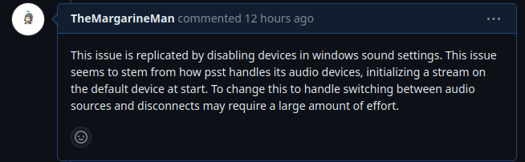
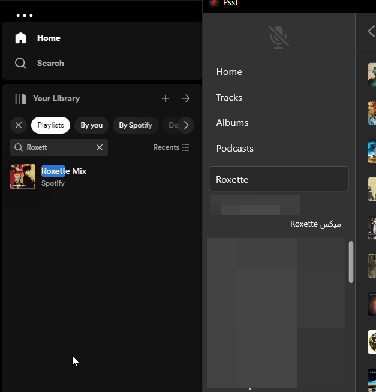
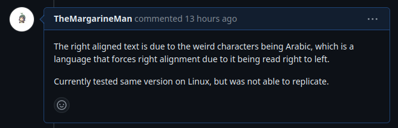

## Psst - The Fast Spotify Client
Psst is a custom built client for Spotify made using Rust and the Druid libraries. It boasts having better performance than the native Spotify client that is built on Electron, a framework critiqued mostly on its resource utilization. Psst accomplishes this by being written entirely in Rust, a lower level programming language, and connects to the Spotify WebAPI using your account to playback songs from the site.

## Why Psst?
I chose this application for the bug fix for a few reasons. The first being that I like the application for its sensible resource utilization. I use a laptop with poor battery life, and Electron applications, like Spotify, have reduced the battery life of my laptop significantly in the past. This led to me looking for alternatives to using Electron apps, and Psst was the best alternative I found for Spotify.
The second reason I chose this application was because of the fact it was written in Rust. Rust seems to be skyrocketing in growth so I feel like experience with the language would be valuable for me, as I am studying software engineering.
The final reason was simple, this community seems active. This shown by their correspondence in the active issues, and the frequent commits and PRs being reviewed. 

## What to fix, what to fix?
There were many issues and enhancements to choose from, but one caught my eye. [#449](https://github.com/jpochyla/psst/issues/449), where if an audio device is disconnected, Psst no longer outputs audio without a restart. I thought this would be a good choice as much of the other issues seem to be problems on inaccessible operating systems (macOS), or are problems that integrate with other systems. Also, there didn't seem to be anyone lo

## Off to the races.
To begin, I needed to find where the issue was occuring. Luckily, the one who reported this issue provided a log when the bug occurred. 

[2024-01-18T14:11:57Z ERROR psst_core::audio::output::cpal] audio output error: The requested device is no longer available. For example, it has been unplugged.

This error pointed me directly to the right place. I was able to see the `cpal.rs` file to get a better idea of what is happening. 

## In over my head...
I found the implementation for the `Stream` object, and then I realized how out of depth I was for this bug. I used the debugger to discover where the `Stream` was created and found it within a playback controller. The issue with attempting to fix the issue is that it requires changing the way that audio is fundamentally handled in this application, adding new features like audio switching. I neither know rust nor am I the most familiar with this codebase, so I decided to back off and let someone else handle this problem. I provided a comment regarding a way to replicate the issue and what might be needed to resolve this issue.

## Trying to help elsewhere
I went to look for more issues to help with, and I found issue [#466](https://github.com/jpochyla/psst/issues/466), where some odd text was being displayed in the place of English.

I noticed quickly that the text was Arabic, and that Arabic forces text to be right-aligned, due to the language being read from right-to-left. I built the version that the user was currently on to see if I was able to replicate the issue but unfortunately couldn't. I decided to add a comment there as well. 

## Conclusion
I realized that I was out of my depth and over ambitious for my first open-source contribution. However I have learned about how Rust works better, and I gained more experience working through a debugger. I do wish that I was wore knowledgable about Rust however, as it would be an incredible improvement on the application to allow dynamic audio events. I will try to contribute in the future, but I probably should interact with easier to work with systems before I return to this project. 